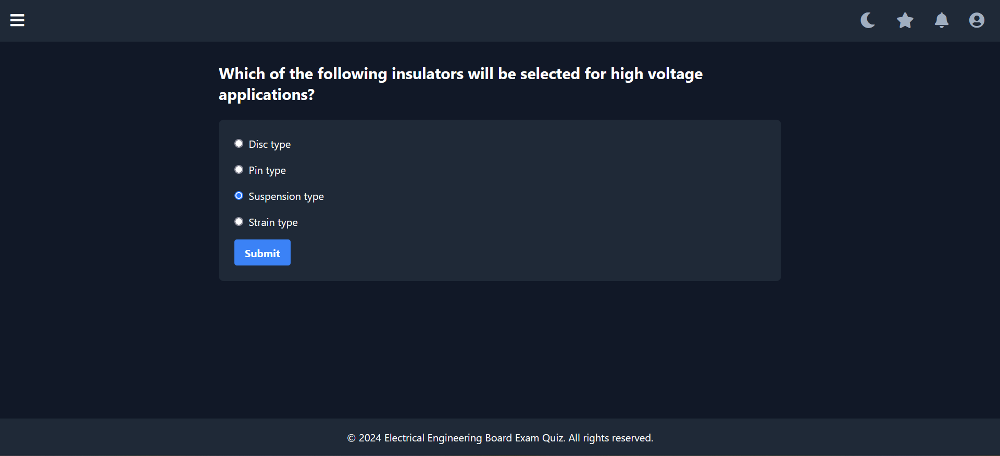

# Electrical Engineering Board Exam Quiz 📚⚡

A comprehensive web application designed to help electrical engineering students prepare for their board examinations through interactive quizzes, progress tracking, and personalized learning experiences.





## 🌟 Features

### User Management
- **Secure Authentication System**
  - Email verification for new registrations
  - Password reset functionality
  - Remember me option
  - Role-based access control (Admin/User)

### Quiz System
- **Customizable Quiz Setup**
  - Subject selection (Engineering Mathematics, Engineering Science, Electrical Engineering)
  - Topic filtering within each subject
  - Three difficulty levels (Easy, Medium, Hard)
  - Randomized question selection

- **Interactive Quiz Experience**
  - Real-time score tracking
  - Progress indicators
  - Immediate feedback on answers
  - Explanations for correct answers

### Progress Tracking
- **Comprehensive Dashboard**
  - Overall performance metrics
  - Subject-wise progress visualization
  - Recent quiz history
  - Favorite subject statistics

- **Achievement System**
  - Unlockable achievements
  - Streak tracking
  - Honor points system
  - Ranking system

### Analytics
- **Performance Metrics**
  - Score distribution
  - Time-based analytics
  - Topic mastery tracking
  - Difficulty level progression

## 🛠️ Technical Stack

### Backend
- **Framework**: Flask
- **Database**: SQLAlchemy with SQLite
- **Authentication**: Flask-Login
- **Admin Interface**: Flask-Admin
- **Email System**: Flask-Mail
- **Form Handling**: Flask-WTF
- **Database Migrations**: Flask-Migrate

### Frontend
- **CSS Framework**: TailwindCSS v2.2.19
- **Icons**: Font Awesome 5.15.3
- **JavaScript**: jQuery 3.6.0
- **Template Engine**: Jinja2

## 📦 Installation

1. Clone the repository
```bash
git clone https://github.com/Murasakiao/EE_Quiz
cd ee-quiz
```

2. Create and activate virtual environment
```bash
python -m venv venv
source venv/bin/activate  # For Linux/Mac
venv\Scripts\activate     # For Windows
```

3. Install dependencies
```bash
pip install -r requirements.txt
```

4. Set up environment variables
```bash
cp .env.example .env
# Edit .env with your configuration
```

Required environment variables:
```plaintext
SECRET_KEY=your_secret_key
MAIL_SERVER=your_mail_server
MAIL_PORT=587
MAIL_USE_TLS=True
MAIL_USERNAME=your_email
MAIL_PASSWORD=your_password
MAIL_DEFAULT_SENDER=your_email
```

5. Initialize the database
```bash
flask db upgrade
python init_db.py
```

## 🚀 Usage

1. Start the development server
```bash
flask run
```

2. Access the application at `http://localhost:5000`

3. Register a new account and verify your email

4. Start taking quizzes!

## 👨‍💻 Administrator Guide

### Accessing Admin Panel
1. Create an admin user using the CLI tool
```bash
flask create-admin
```

2. Access admin panel at `/admin`

### Admin Features
- Manage questions and topics
- View user statistics
- Monitor quiz attempts
- Manage achievements
- View system logs

## 📚 Database Schema

### Core Tables
- **Users**: User account information
- **Roles**: User role definitions
- **Questions**: Quiz questions and answers
- **Topics**: Subject topics and categories
- **QuizAttempts**: User quiz attempts and scores
- **Achievements**: Available achievements
- **UserAchievements**: User-achievement relationships

## 🌟 Features in Detail

### Subject Areas
1. **Engineering Mathematics**
   - Algebra and Complex Numbers
   - Trigonometry
   - Analytic Geometry
   - Calculus
   - Differential Equations
   - And more...

2. **Engineering Science**
   - Chemistry for Engineers
   - Physics for Engineers
   - Computer Programming
   - Material Science
   - Fluid Mechanics
   - And more...

3. **Electrical Engineering**
   - Electromagnetism
   - Electric Circuits
   - Electronics
   - Electrical Machinery
   - Power Systems
   - And more...

### Achievement System
- **Quiz Novice**: Complete your first quiz
- **Streak Master**: Maintain a 7-day streak
- **Perfect Score**: Get 100% on any quiz
- **Quiz Marathoner**: 30-day streak
- **Diligent Learner**: Complete all subjects

## 🤝 Contributing

1. Fork the repository
2. Create your feature branch
```bash
git checkout -b feature/AmazingFeature
```
3. Commit your changes
```bash
git commit -m 'Add some AmazingFeature'
```
4. Push to the branch
```bash
git push origin feature/AmazingFeature
```
5. Open a Pull Request

## 📝 License

This project is licensed under the MIT License - see the [LICENSE](LICENSE) file for details.

## 🙏 Acknowledgments

- Flask and its extensions contributors
- TailwindCSS team
- All contributors and testers

## 📧 Contact

Your Name - your.email@example.com

Project Link: https://github.com/Murasakiao/EE_Quiz

---

Made with ❤️ for Electrical Engineering students